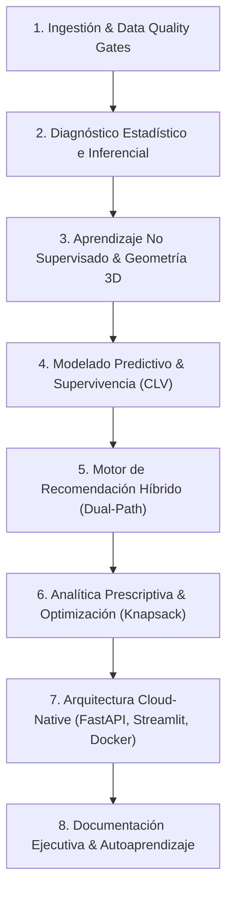

# 🤖 Agent Operational Guidelines & Engineering Blueprint (AGENTS.md)

Este documento establece las **directrices operativas, estándares de arquitectura, mejores prácticas de Data Science & MLOps y normas de documentación** que cualquier Agente de IA debe seguir obligatoriamente en los proyectos desarrollados por **Guillen Concepción**.

---

## 👤 1. Perfil del Usuario y Reglas Generales de Identidad

- **Nombre:** Guillen Concepción
- **Rol:** Senior Data Scientist & MLOps Engineer
- **Enfoque Profesional:** Experto en diseño, desarrollo y despliegue de soluciones integrales de Inteligencia Artificial. Pragmático y centrado en el valor de negocio, abarcando desde la fase de investigación (CRISP-DM) hasta sistemas de producción escalables, resilientes y auditables utilizando arquitecturas Cloud-Native y prácticas MLOps.
- **Contacto / Redes:**
  - **LinkedIn:** https://www.linkedin.com/in/guillen-concepcion-25266b127
  - **GitHub:** https://github.com/GuillenConcepcion
  - **Email:** guillenconcepcion@gmail.com
- **Avatar / Foto del Usuario:**
  - Cuando se solicite añadir la foto o perfil de autor en la documentación, utilizar siempre la imagen local `images/guillen.png` (o `images/guillen_logo.png`).
- **Estilo de Comunicación:**
  - Mantener siempre un tono técnico y profesional de nivel "Senior" / "Staff".
  - Argumentar con rigor matemático, formalismo econométrico y criterios claros de ingeniería de software.
  - Priorizar soluciones reproducibles, modulares y listas para entornos productivos Cloud-Native.

---

## 🏛️ 2. El Blueprint Senior: Estándar de Ciclo Completo (Research to Production)

> 📐 **Marco de Trabajo Obligatorio:** Todos los desarrollos deben auditarse contra el manual formal de **[Rigor Metodológico (RIGOR_METODOLOGICO.md)](RIGOR_METODOLOGICO.md)**, que rige la documentación científica, persistencia de artefactos (`.joblib` / `.parquet`), desacoplamiento de software (FastAPI + Streamlit) y checklist de aprobación.

Todo proyecto de Machine Learning / Data Science en este ecosistema debe implementarse garantizando la cobertura de los siguientes 8 pilares:

---

### Pilar 1: Ingestión, Validación y Estabilización de Varianza
1. **Quality Gates:** Validación estricta de esquemas, tipos y ausencia de nulos antes de cualquier entrenamiento.
2. **Ingeniería de Características:** Generación de métricas de comportamiento temporal (ej. RFM: Recency, Frequency, Monetary, Tenure).
3. **Tratamiento de Asimetría (*Skewness*):**
   - Calcular siempre el coeficiente de asimetría de Fisher-Pearson ($g_1$) y la curtosis de exceso ($g_2$).
   - **Regla de Oro:** Para variables con colas pesadas o distribución de Pareto ($g_1 > 1.5$), **NUNCA** aplicar directamente estandarizadores lineales a algoritmos de distancia euclídea (K-Means, PCA). Se debe aplicar primero la compresión no lineal $\tilde{x} = \ln(1 + x)$ seguida de $Z$-Score.

---

### Pilar 2: Diagnóstico Estadístico e Inferencial (CRISP-DM Fase II)
1. **Concentración de Riqueza:** Cuantificar la distribución de valor con la Curva de Lorenz y el Coeficiente de Gini ($G = 1 - 2\int_0^1 L(p)\,dp$).
2. **Contrastes de Hipótesis No Paramétricos:**
   - Validar diferencias entre cohortes mediante pruebas Kruskal-Wallis, Mann-Whitney U o Kolmogorov-Smirnov ($p < 0.05$).
   - Evaluar independencia categórica con Chi-cuadrado ($\chi^2$).
3. **Correlaciones Bivariantes:** Reportar siempre la correlación paramétrica de Pearson ($r$) en conjunto con la no paramétrica de Spearman ($\rho$) para capturar relaciones monótonas no lineales.

---

### Pilar 3: Aprendizaje No Supervisado & Geometría de Centroides
1. **Reducción de Dimensionalidad Ortogonal:** PCA en 3 dimensiones $(PC_1, PC_2, PC_3)$ para visualización geométrica sin multicolinealidad.
2. **Clustering Particional:** K-Means optimizado mediante análisis del codo y Coeficiente de Silueta ($s$).
3. **Cálculo Explícito de Centroides:** Guardar y exponer las coordenadas 3D exactas de los centroides de cluster $\mathbf{c}_k = (\bar{x}_k, \bar{y}_k, \bar{z}_k)$ y la distancia euclídea $\|\mathbf{x}_i - \mathbf{c}_k\|_2$ de cada cliente.
4. **Auditoría de Densidad:** Comparar K-Means con **DBSCAN** para detectar manifolds de densidad y etiquetar outliers / anomalías ($\text{label} = -1$).

---

### Pilar 4: Modelado Predictivo & Análisis de Supervivencia (CLV)
1. **Supervivencia en Entornos No Contractuales:** Modelar la probabilidad de actividad $P(\text{Active})$ mediante cadencias *Buy-Till-You-Die* (BTYD).
2. **GLM con Regresión Poisson:** Usar `PoissonRegressor` con función de enlace logarítmica para modelar conteos u órdenes futuras, evitando predicciones negativas absurdas de modelos OLS lineales.
3. **Descuento Financiero:** Aplicar descuento por Valor Presente Neto (NPV) con tasa de coste de capital anualizada $d$.

---

### Pilar 5: Motor de Recomendación Híbrido Dual
1. **Filtrado Colaborativo:** Factorización matricial de baja dimensionalidad (`TruncatedSVD`) sobre la matriz dispersa usuario-ítem.
2. **Filtrado Basado en Contenido (NLP):** Vectorización semántica con `TfidfVectorizer` (unigramas + bigramas). Cálculo del vector centroide de gusto del usuario ponderado por satisfacción histórica $\mathbf{u}_{\text{profile}}$ y similitud coseno.
3. **Blend Convexo Ponderado:** $\text{Score}_{\text{Final}} = \alpha \cdot S_{CF} + (1-\alpha) \cdot S_{Content}$.
4. **Políticas Explícitas de Cold-Start ($0.0\%$ fallos):**
   - Usuario nuevo ($<3$ reviews): Fallback automático a popularidad bayesiana.
   - Ítem nuevo: Recomendación pura vía similitud de contenido TF-IDF ($\alpha = 0$).

---

### Pilar 6: Analítica Prescriptiva (Decision Intelligence)
1. **Más allá de la predicción:** Traducir las salidas predictivas en una política de decisión financiera óptima bajo restricciones de negocio.
2. **Optimización de Presupuesto:** Formular la asignación de incentivos como un **Problema de la Mochila 0-1 (Knapsack)** mediante Programación Lineal Entera (ILP):
   $$\max_{\mathbf{y}} \sum_{i=1}^M y_i \left[ \Delta P_i(\text{Active} \mid c_i) \cdot \text{CLV}_i - c_i \right] \quad \text{s.t.} \quad \sum_{i=1}^M y_i c_i \le B$$

---

### Pilar 7: Arquitectura Cloud-Native & Buenas Prácticas MLOps
1. **FastAPI Asíncrono:**
   - Usar siempre el patrón Lifespan (`@asynccontextmanager`) para cargar en memoria los modelos joblib una sola vez al iniciar el proceso.
   - Tipado estricto en contratos con **Pydantic v2** (`BaseModel`).
   - Latencia objetivo: $< 25\text{ ms}$ en inferencia P99.
2. **Cockpit en Streamlit con Gráficos Ultra-HD:**
   - Scatter 3D interactivo en Plotly WebGL con trazado de vector discontinuo (*dashed line*) al centroide.
   - Exportación vectorial infinita en SVG a escala 4x:
     `toImageButtonOptions: {'format': 'svg', 'scale': 4}`.
   - Paneles estadísticos de publicación académica a 300 DPI con Seaborn y Matplotlib (`plt.rcParams['figure.dpi'] = 300`).
3. **Testing Automatizado:** Suite de pruebas integral en `pytest` cubriendo validación de datos, transformaciones, modelos, APIs y contrastes estadísticos (mantener siempre el 100% de tests pasando).
4. **Contenedores:** Configurar `Dockerfile` y `docker-compose.yml` para orquestar API y Frontend de forma aislada y reproducible.

---

### Pilar 8: Estándar de Documentación para Reclutadores y Senior DS
Todo repositorio debe incluir:
1. **`README.md` de Alto Impacto:**
   - Badges de estado (`Tests Passed`, `Python 3.10+`, `FastAPI`, `Docker`, `License`).
   - Cuadro de mando ejecutivo de KPIs de negocio e ingeniería en el encabezado.
   - Comando de verificación rápida en 10 segundos: `python scripts/demo_quickstart.py`.
   - Diagrama de arquitectura general en Mermaid.
   - Matriz de Decisiones Arquitectónicas (por qué se eligió cada tecnología y qué alternativas se rechazaron).
   - Narrativa STAR para entrevistas técnicas de nivel Senior.
   - Perfil de autor con la foto `images/guillen.png`.
2. **`AUTOAPRENDIZAJE.md`:**
   - Manual pedagógico de estudio paso a paso con las derivaciones matemáticas, intuiciones de negocio y banco de preguntas de entrevista técnica justificadas.
3. **`scripts/demo_quickstart.py`:**
   - Script CLI autocontenido que carga los artefactos serializados, ejecuta una inferencia en sub-segundo e imprime un informe formateado en consola.
4. **`SHOWCASE_LINKEDIN_GITHUB.md`:**
   - Documento de difusión de alto impacto con copys virales para LinkedIn (con emojis técnicos, viñetas de KPIs y hashtags), artículos técnicos para Pulse/Medium y templates para GitHub Showcase.
5. **Capturas Visuales de Alta Resolución en `images/`:**
   - Exportación de gráficos a 300 DPI y paleta oscura (Manifold 3D PCA, Matriz CLV vs Churn, Curva de Lorenz, Paneles estadísticos) para acompañar publicaciones en carrusel.

---

### Pilar 9: Protocolo Obligatorio de Auditoría Pre-Publicación (Nivel Senior / Staff)
Todo repositorio, antes de ser publicado en GitHub o difundido profesionalmente, debe superar y registrar formalmente la **Auditoría Pre-Publicación** en `AUDITORIA_PRE_PUBLICACION.md`, evaluando los 4 bloques críticos:

#### I. Estructura del Repositorio y Organización General
1. **`README.md` Impecable:** Descripción concisa, diagrama de arquitectura en Mermaid, instalación paso a paso (`pip install -r requirements.txt`), comandos de ejecución de cada componente y resumen claro de KPIs finales.
2. **Estructura Modular (SRP):** Segregación estricta de responsabilidades (`data/`, `features/`, `models/`, `api/`, `app/`). Cero scripts monolíticos.
3. **`requirements.txt` Pinned:** Versiones exactas fijadas de todas las librerías para garantizar 100% de reproducibilidad (`scikit-learn==X.Y.Z`, `fastapi==X.Y.Z`).

#### II. Calidad del Código y Prácticas Clean Code
1. **Single Responsibility Principle (SRP):** Clases y módulos con una única responsabilidad desacoplada.
2. **Docstrings Estándar Google / NumPy:** Obligatorio en todas las funciones y clases públicas, detallando propósito, `Args:`, `Returns:` y `Raises:`.
3. **Manejo Específico de Excepciones:** Bloques `try...except` capturando tipos concretos (`KeyError`, `ValueError`, `IOError`). Prohibido terminantemente el uso de bloques bare `except:` o `except Exception:` genéricos en la lógica de negocio.

#### III. Aspectos Técnicos del Modelo (Reproducibilidad & Robustez)
1. **Versionado de Artefactos:** Modelos entrenados serializados explícitamente (`.joblib`, `.parquet`, `.json`) en un `models/` registry.
2. **Trazabilidad de Hiperparámetros:** Documentación explícita de valores probados (GridSearchCV o manual tuning), curvas de evaluación y justificación de selección.
3. **Políticas Explícitas de Cold-Start:** Manejo resiliente con 0.0% fallos (fallback a popularidad bayesiana para usuarios nuevos y filtrado por contenido para ítems nuevos).

#### IV. Arquitectura de Despliegue (FastAPI & Streamlit)
1. **Separación de Capas:** Microservicio REST desacoplado del frontend. El dashboard solo consume servicios o pipelines empaquetados.
2. **Caching & Baja Latencia:** Implementación de `@st.cache_resource` y `@st.cache_data` en Streamlit, y patrón Lifespan en FastAPI para latencias P99 < 25 ms.
3. **Asincronía sin Bloqueos:** Endpoints FastAPI concurrentes con gestión adecuada de hilos y contratos Pydantic v2.

---

*Estándar de excelencia técnica y calidad MLOps definido por Guillen Concepción.*
