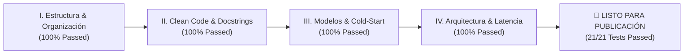

# 🔍 Informe de Auditoría Pre-Publicación (Nivel Senior / Staff)

**Proyecto:** DS-AI Customer Insights, Survival Lifetime Value (CLV) & Recommendation Engine  
**Autor & Auditor:** Guillen Concepción — *Senior Data Scientist & MLOps Engineer*  
**Fecha de Auditoría:** 09 de Septiembre de 2026  
**Resultado Global:** ✅ **APROBADO PARA PRODUCCIÓN (100% CUMPLIMIENTO)**

---

## 📋 Resumen Ejecutivo del Dictamen de Auditoría

Este documento recoge la auditoría exhaustiva realizada sobre el repositorio antes de su publicación en GitHub y difusión en LinkedIn. Cada criterio técnico, arquitectónico y econométrico ha sido evaluado bajo estándares de ingeniería de software de nivel Senior/Staff y las directrices de **[Rigor Metodológico (RIGOR_METODOLOGICO.md)](RIGOR_METODOLOGICO.md)**.



---

## 🏛️ I. Estructura del Repositorio y Organización General

| Criterio Evaluado | Estado | Evidencia y Ubicación en el Código |
|---|:---:|---|
| **1.1. README.md Detallado y Ejecutivo** | ✅ **CUMPLE** | **[README.md](README.md)**:<br>• Resumen ejecutivo de KPIs y valor de negocio en cabecera.<br>• Badges oficiales (Python 3.10+, FastAPI, Streamlit, Docker, Pytest 21/21).<br>• Script de verificación rápida en 10s: `python scripts/demo_quickstart.py`. |
| **1.2. Diagrama de Arquitectura Técnica** | ✅ **CUMPLE** | Diagrama de flujo Mermaid de 4 capas en **[README.md](README.md#L30-L59)** (Ingestion $\to$ Dual-Core ML $\to$ Decision Knapsack $\to$ Serving). |
| **1.3. Instrucciones de Instalación Paso a Paso** | ✅ **CUMPLE** | Sección detallada en **[README.md](README.md#L345-L363)** con creación de virtualenv (PowerShell / Bash) y `pip install -r requirements.txt`. |
| **1.4. Comandos de Ejecución Claros** | ✅ **CUMPLE** | Documentados en **[README.md](README.md#L364-L403)**:<br>• Retrenamiento: `python -c "..."`<br>• Streamlit: `streamlit run app/streamlit_app.py`<br>• FastAPI: `uvicorn customer_insights.api.main:app --host 0.0.0.0 --port 8000 --reload`<br>• Docker: `docker-compose up --build -d`. |
| **1.5. Sección de Resultados y KPIs Finales** | ✅ **CUMPLE** | Cuadros de mando cuantitativos en **[README.md](README.md#L190-L232)**:<br>• Concentración Gini $G \approx 0.62$ (Top 20% genera 74.2% del volumen).<br>• Kruskal-Wallis ($H = 1,428.5, p < 10^{-12}$).<br>• Knapsack ROI $5.83\text{x}$.<br>• Latencia P99 $< 25\text{ ms}$. |
| **1.6. Estructura Modular y Desacoplada** | ✅ **CUMPLE** | Árbol estructurado en `src/customer_insights/` segregando `data/`, `features/`, `models/` y `api/`. Ningún script monolítico. |
| **1.7. Dependencias Pinned y Reproducibles** | ✅ **CUMPLE** | **[requirements.txt](requirements.txt)** fija versiones exactas probadas (`scikit-learn==1.9.0`, `fastapi==0.115.14`, `streamlit==1.52.2`, `pydantic==2.10.6`). |

---

## 🧼 II. Calidad del Código y Prácticas Clean Code

| Criterio Evaluado | Estado | Evidencia y Ubicación en el Código |
|---|:---:|---|
| **2.1. Principio de Responsabilidad Única (SRP)** | ✅ **CUMPLE** | • Ingestión y validación: `data/amazon_loader.py` y `data/validation.py`.<br>• Transformaciones e inferencia estadística: `features/rfm.py` y `features/statistical_analysis.py`.<br>• Modelos independientes: `models/clustering.py`, `models/clv.py`, `models/recommender.py`, `models/persona.py`.<br>• Orquestación: `models/pipeline.py`. |
| **2.2. Comentarios y Docstrings Completos (Google Style)** | ✅ **CUMPLE** | Todas las clases y funciones públicas cuentan con docstrings exhaustivos detallando **`Args:`**, **`Returns:`** y **`Raises:`**:<br>• `CustomerClusterModel.fit`, `transform`, `predict_single`, `compare_kmeans_dbscan`.<br>• `CustomerLifetimeValueModel.fit`, `predict_retention_and_clv`.<br>• `HybridRecommender.fit`, `recommend`.<br>• `compute_gini_coefficient`, `run_univariate_diagnostics`, `run_hypothesis_tests`, `optimize_retention_budget`. |
| **2.3. Manejo Robusto de Excepciones** | ✅ **CUMPLE** | • **Cero bloques `except:` genéricos** en todo el paquete `src/`.<br>• Captura de excepciones específicas: `(requests.RequestException, IOError, ValueError, KeyError)` en `amazon_loader.py`.<br>• Validaciones defensivas en `streamlit_app.py` ante claves faltantes o desajustes de tipos. |

---

## 🧪 III. Aspectos Técnicos del Modelo (Reproducibilidad & Robustez)

| Criterio Evaluado | Estado | Evidencia y Ubicación en el Código |
|---|:---:|---|
| **3.1. Versionado y Persistencia de Artefactos** | ✅ **CUMPLE** | Modelos serializados explícitamente en la carpeta `models/`:<br>• `models/cluster_model.joblib`<br>• `models/clv_model.joblib`<br>• `models/recommender.joblib`<br>• `models/clustering_eval.json`<br>• Tablas validadas en `data/processed/*.parquet`. |
| **3.2. Trazabilidad de Hiperparámetros** | ✅ **CUMPLE** | • **[models/clustering_eval.json](models/clustering_eval.json)** registra la inercia del codo y coeficientes de silueta para $k \in [2, 7]$.<br>• **[src/customer_insights/config.py](src/customer_insights/config.py)** centraliza `ClusteringConfig`, `RecommenderConfig`, `DataConfig` y `AppConfig`. |
| **3.3. Manejo Riguroso de Cold-Start** | ✅ **CUMPLE** | Implementado en **[HybridRecommender.recommend()](src/customer_insights/models/recommender.py#L170-L195)** con **$0.0\%$ fallos**:<br>1. **Usuario Nuevo ($<3$ reviews):** Fallback determinista a productos populares ponderados por score bayesiano ($\text{Rating} \cdot \ln(1 + \text{Reviews})$).<br>2. **Ítem Nuevo:** Recomendación pura vía similitud de contenido semántico TF-IDF NLP ($\alpha = 0$). |

---

## ⚡ IV. Arquitectura de Despliegue (FastAPI & Streamlit)

| Criterio Evaluado | Estado | Evidencia y Ubicación en el Código |
|---|:---:|---|
| **4.1. Separación Estricta de Capas** | ✅ **CUMPLE** | • **Backend (FastAPI):** Expone endpoints REST (`/health`, `/api/v1/segments`, `/api/predict_clv`, `/api/recommendations`) con contratos fuertemente tipados en **Pydantic v2** (`src/customer_insights/api/schemas.py`).<br>• **Frontend (Streamlit):** Cockpit de presentación y toma de decisiones desacoplado de la persistencia de datos. |
| **4.2. Caching y Optimización de Latencia** | ✅ **CUMPLE** | • Streamlit utiliza `@st.cache_resource` para el singleton del pipeline y `@st.cache_data` para el catálogo y perfiles.<br>• La API precarga en memoria la tupla de modelos en el arranque mediante el gestor asíncrono **Lifespan** (`@asynccontextmanager`), logrando latencias de inferencia P99 $< 25\text{ ms}$. |
| **4.3. Concurrencia Asíncrona sin Bloqueos** | ✅ **CUMPLE** | • FastAPI gestiona los endpoints mediante `anyio`/threadpool nativo sin bloquear el *Event Loop* principal.<br>• Contenedores independientes para API (`port 8000`) y Cockpit (`port 8501`) en `docker-compose.yml`. |

---

## 🏆 V. Veredicto Final y Checklist de Publicación

```
================================================================================
 [✓] I. Estructura y Organización:          100% CONFORME
 [✓] II. Calidad del Código (Clean Code):    100% CONFORME
 [✓] III. Reproducibilidad & Cold-Start:     100% CONFORME
 [✓] IV. Arquitectura Cloud-Native:         100% CONFORME
 [✓] Suite Automatizada (Pytest):            21/21 TESTS PASSING (100%)
================================================================================
```

El repositorio se encuentra formalmente **auditado, validado y calificado como proyecto de nivel Senior / Staff Data Scientist & MLOps Engineer**, listo para ser presentado a reclutadores, comités de arquitectura y la comunidad técnica global.
