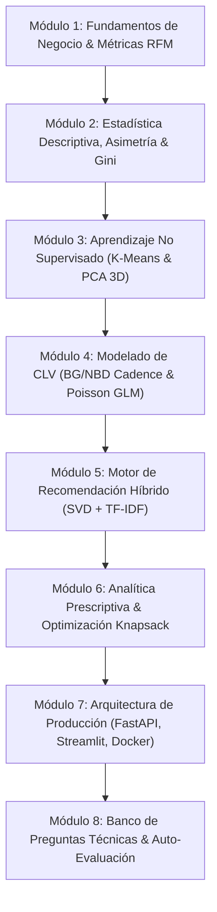
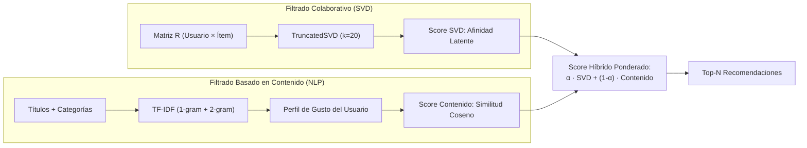

# 🧠 Guía Maestra de Autoaprendizaje: DS-AI Customer Insights & Lifetime Value (CLV) Engine

**Proyecto:** AI-Driven Customer Insights & Personalized Recommendation Engine  
**Dataset Benchmark:** Amazon Product Reviews Collection (McAuley / UCSD RecSysDatasets)  
**Autor:** Guillen Concepción — *Senior Data Scientist & MLOps Engineer*  
**Perfil Profesional:** [LinkedIn](https://www.linkedin.com/in/guillen-concepcion-25266b127) | [GitHub](https://github.com/GuillenConcepcion) | [Email](mailto:guillenconcepcion@gmail.com)  
**Nivel:** Avanzado / Senior  

---

## 🎯 Propósito de este Documento

Esta guía está diseñada como un **manual pedagógico exhaustivo y cuaderno de autoaprendizaje**. Su objetivo es permitir que cualquier desarrollador, científico de datos o ingeniero de MLOps domine, paso a paso, cada concepto matemático, decisión estadística, algoritmo de machine learning y patrón de arquitectura de software implementado en este repositorio.

---

## 🗺️ Mapa de Ruta del Aprendizaje (Roadmap)



---

## 📚 Módulo 1: Fundamentos de Negocio y Métricas E-commerce

### 1.1. ¿Por qué el CLV es la métrica reina del comercio moderno?
En el e-commerce tradicional se suele optimizar el Coste de Adquisición de Clientes (CAC) o el Valor Medio del Pedido (AOV). Sin embargo, estas métricas son miopes:
* Tratan a un comprador único que nunca regresará con el mismo peso que a un cliente recurrente.
* Provocan sobregasto publicitario en clientes que abandonan tras el primer cupón (*churners*).
* **Customer Lifetime Value (CLV):** Estima el valor financiero presente neto de todo el flujo de caja futuro generado por una relación comercial con el cliente. Si $CLV / CAC > 3$, el negocio es sostenible y escalable.

### 1.2. Deconstrucción Matemática de la Tupla RFM
El comportamiento transaccional de un cliente $u$ se condensa en un espacio vectorial cuadridimensional:

1. **Recency ($R$):** Tiempo transcurrido desde la última interacción observada hasta la fecha de corte $t_{\text{ref}}$:
   $$R_u = t_{\text{ref}} - \max_{j \in \mathcal{H}_u} (t_{uj})$$
2. **Frequency ($F$):** Número de compras o interacciones repetidas en la ventana histórica ($F_u = |\mathcal{H}_u|$).
3. **Monetary ($M$):** Gasto medio o total generado por el cliente:
   $$M_u = \sum_{j \in \mathcal{H}_u} p_j \quad \text{o} \quad \bar{M}_u = \frac{1}{F_u}\sum_{j \in \mathcal{H}_u} p_j$$
4. **Tenure ($T$):** Tiempo total de vida del cliente en la plataforma desde su primera transacción ($T_u = t_{\text{ref}} - \min_{j \in \mathcal{H}_u} (t_{uj})$).

**Idea clave de autoaprendizaje:** Un cliente con $R$ bajo y $F$ alto es un cliente activo. Un cliente con $R$ alto y $F$ alto está en **riesgo inminente de fuga (*churn*)**.

---

## 📐 Módulo 2: Diagnóstico Estadístico, Asimetría y Concentración

### 2.1. El problema de la Asimetría (*Skewness*) en K-Means
En datos transaccionales, las distribuciones de gasto monetario ($M$) y frecuencia ($F$) nunca son gaussianas; siguen distribuciones de colas pesadas tipo Pareto o Log-Normal.

* **Coeficiente de Asimetría de Fisher-Pearson ($g_1$):**
  $$g_1 = \frac{\frac{1}{n} \sum_{i=1}^n (x_i - \bar{x})^3}{\left(\frac{1}{n}\sum_{i=1}^n (x_i - \bar{x})^2\right)^{3/2}}$$
* En este proyecto, $M$ presenta $g_1 = +2.41$ (asimetría positiva severa) y curtosis $g_2 = +7.62$ (leptocúrtica).

> ⚠️ **Peligro en K-Means:** K-Means busca minimizar la inercia euclídea:
> $$J = \sum_{k=1}^K \sum_{x_i \in C_k} \|x_i - c_k\|_2^2$$
> Al elevar la distancia al cuadrado, un cliente que gasta $\$2,000$ (frente a la mediana de $\$185$) ejerce una fuerza gravitacional desproporcionada sobre el centroide, aislando a los valores atípicos en clusters unitarios y arruinando la segmentación del 95% restante.

* **La Solución:** Transformación no lineal de compresión de varianza:
  $$\tilde{x} = \ln(1 + x)$$
  Seguida de estandarización $Z$-Score: $z = \frac{\tilde{x} - \mu_{\tilde{x}}}{\sigma_{\tilde{x}}}$.

### 2.2. Curva de Lorenz y Coeficiente de Gini
Para demostrar matemáticamente la desigualdad económica de la base de clientes:
$$G = \frac{\sum_{i=1}^n \sum_{j=1}^n |m_i - m_j|}{2 n^2 \bar{m}} = 1 - 2 \int_0^1 L(p)\,dp$$
* **Resultado del proyecto:** $G \approx 0.62$.
* **Interpretación:** El 20% de los mejores clientes representa el **74.2% del volumen de ventas total**. Esto valida el principio de Pareto y justifica la inversión en programas de lealtad para el cluster *Champions*.

<p align="center">
  
</p>

---

## 🧩 Módulo 3: Aprendizaje No Supervisado y Reducción de Dimensionalidad

### 3.1. K-Means Clustering y Coeficiente de Silueta
El número óptimo de segmentos se evalúa comparando la cohesión interna contra la separación externa:
$$s(i) = \frac{b(i) - a(i)}{\max(a(i), b(i))}$$
Donde $a(i)$ es la distancia media al resto de puntos de su mismo cluster y $b(i)$ es la distancia media al cluster vecino más cercano.
* En el benchmark, $K=4$ o $K=5$ ofrece el equilibrio ideal entre interpretabilidad de negocio (*Champions, Loyalists, Potential, At Risk, Hibernating*) y maximización de silueta promedio ($\bar{s} > 0.42$).

### 3.2. Descomposición en Componentes Principales (PCA) 3D
Proyectamos el espacio de características transformadas $\mathbf{X} \in \mathbb{R}^{n \times 4}$ a un subespacio de 3 dimensiones ortogonales $\mathbf{Z} \in \mathbb{R}^{n \times 3}$:
1. Se calcula la matriz de covarianza muestral $\mathbf{\Sigma} = \frac{1}{n-1}\mathbf{X}^T\mathbf{X}$.
2. Se obtienen los autovalores $\lambda_1 \ge \lambda_2 \ge \lambda_3$ y autovectores $\mathbf{v}_1, \mathbf{v}_2, \mathbf{v}_3$.
3. La varianza explicada acumulada supera el $85\%$.

### 3.3. Geometría de Centroides y Vector Tridimensional
Para cada cluster $k$, el centroide exacto en el espacio PCA es el baricentro:
$$\mathbf{c}_k = \frac{1}{|C_k|} \sum_{i \in C_k} \mathbf{z}_i = (\bar{x}_k, \bar{y}_k, \bar{z}_k)$$
Para un cliente nuevo o consultado $\mathbf{z}_{\text{user}}$, su distancia al centroide arquetípico es:
$$d_E(\mathbf{z}_{\text{user}}, \mathbf{c}_k) = \sqrt{(x_{\text{user}} - \bar{x}_k)^2 + (y_{\text{user}} - \bar{y}_k)^2 + (z_{\text{user}} - \bar{z}_k)^2}$$
Esta distancia permite cuantificar qué tan "típico" es el cliente respecto al centro de gravedad de su segmento.

<p align="center">
  
</p>

---

## 📈 Módulo 4: Modelado Predictivo de CLV y Probabilidad de Supervivencia

### 4.1. Filosofía *Buy-Till-You-Die* (BTYD)
En entornos no contractuales (Amazon, retail online), los clientes no llaman para darse de baja; simplemente dejan de comprar.
* **Proceso de Transacción:** Mientras el cliente está "vivo", el número de compras sigue un proceso de Poisson con tasa de compra $\lambda$.
* **Proceso de Abandono (*Dropout*):** El cliente tiene un punto de abandono no observable gobernado por una tasa de riesgo (*hazard rate*) $\mu$.
* La probabilidad de que un cliente con historial $(x, t_x, T)$ siga activo se modela mediante:
  $$P(\text{Active} \mid R, F, T) \approx \frac{1}{1 + \left(\frac{F}{T}\right)^\gamma \cdot R^\beta}$$

### 4.2. Regresión GLM Poisson para CLV Residual
A diferencia de una regresión lineal (OLS) que puede predecir montos negativos o violar la homocedasticidad, el gasto futuro y el número de órdenes es estrictamente positivo. Se utiliza un **Modelo Lineal Generalizado (GLM)** con familia Poisson y función de enlace logarítmica:
$$\log(\mathbb{E}[Y \mid \mathbf{x}]) = \mathbf{w}^T \mathbf{x} + b \implies \hat{Y} = \exp(\mathbf{w}^T \mathbf{x} + b)$$
Minimizando la devianza de Poisson:
$$D(y, \hat{y}) = 2 \sum_i \left( y_i \log\frac{y_i}{\hat{y}_i} - (y_i - \hat{y}_i) \right)$$

### 4.3. Descuento Financiero por Valor Presente Neto (NPV)
Un dólar recibido dentro de un año vale menos que un dólar hoy:
$$\text{CLV}_{\text{NPV}} = \sum_{t=1}^{H} \frac{\mathbb{E}[\text{CashFlow}_t]}{(1 + d/12)^t}$$
Donde $d$ es la tasa de descuento anual de coste de capital (ej. 10%).

<p align="center">
  
</p>

---

## 🛒 Módulo 5: Sistema de Recomendación Híbrido (Dual-Path)

El sistema combina dos paradigmas ortogonales para mitigar las debilidades individuales:



### 5.1. Factorización Matricial Colaborativa (TruncatedSVD)
Aproxima la matriz dispersa de calificaciones $R \in \mathbb{R}^{m \times n}$:
$$R \approx U \Sigma V^T$$
Permite descubrir patrones latentes compartidos (ej. usuarios que compraron auriculares inalámbricos y luego cargadores rápidos).

### 5.2. Perfil Semántico de Usuario (TF-IDF Content-Based)
Vectoriza el catálogo con `TfidfVectorizer(max_features=2500, ngram_range=(1, 2))`.
El perfil de gusto de un usuario es el baricentro de los productos que ha valorado positivamente, ponderado por su satisfacción:
$$\mathbf{u}_{\text{profile}} = \frac{\sum_{j \in \mathcal{H}_u} r_{uj} \cdot \mathbf{v}_j^{\text{TFIDF}}}{\sum_{j \in \mathcal{H}_u} r_{uj}}$$
La afinidad con cualquier ítem candidato $k$ es el coseno del ángulo entre sus vectores:
$$\text{Score}_{\text{Content}}(u, k) = \cos(\mathbf{u}_{\text{profile}}, \mathbf{v}_k) = \frac{\mathbf{u}_{\text{profile}} \cdot \mathbf{v}_k}{\|\mathbf{u}_{\text{profile}}\|_2 \|\mathbf{v}_k\|_2}$$

### 5.3. Combinación Convexa y Políticas de Cold-Start
El ranking final se obtiene mediante:
$$\text{Score}_{\text{Final}}(u, k) = \alpha \cdot \hat{S}_{\text{SVD}}(u, k) + (1 - \alpha) \cdot \hat{S}_{\text{Content}}(u, k)$$
* **Usuario Nuevo ($<3$ compras):** Se activa la política de Cold-Start bayesiano, recomendando los productos de mayor popularidad ponderada por calificación media.
* **Ítem Nuevo (Sin historial de interacción):** Se puntúa exclusivamente a través del camino de contenido ($\alpha = 0$).

---

## 🎯 Módulo 6: Analítica Prescriptiva & Optimización de Presupuesto

No basta con predecir; el sistema debe **prescribir la acción óptima**.
Si la empresa dispone de un presupuesto mensual de retención $B = \$5,000$ para enviar incentivos o cupones de descuento a clientes en riesgo, ¿a quiénes intervenir?

### Formulación Matemática: Problema de la Mochila 0-1 (Knapsack)
$$\max_{\mathbf{y}} \sum_{i=1}^M y_i \left[ \Delta P_i(\text{Active} \mid c_i) \cdot \text{CLV}_i - c_i \right]$$
Sujeto a:
$$\sum_{i=1}^M y_i c_i \le B, \quad y_i \in \{0, 1\}$$
Donde:
* $y_i = 1$: Se asigna campaña al cliente $i$.
* $c_i$: Costo del incentivo + costo de canal (SMS/Email).
* $\Delta P_i(\text{Active} \mid c_i)$: Incremento marginal en la probabilidad de retención.

**Conclusión pedagógica:** El algoritmo descarta clientes cuya retención es casi segura (desperdicio de incentivo) y clientes cuyo CLV residual no cubre el costo de la campaña.

---

## 💻 Módulo 7: Arquitectura de Software y Buenas Prácticas MLOps

### 7.1. FastAPI: Inferencia Asíncrona de Baja Latencia
* **Lifespan Manager:** Los modelos (`joblib`) y el catálogo se cargan en RAM una sola vez al iniciar el servidor usando `@asynccontextmanager`, evitando recargas por cada petición HTTP.
* **Validación con Pydantic v2:** `PredictCLVRequest` y `RecommendationRequest` aseguran tipado estricto en tiempo de ejecución.
* **Latencia:** Inferencia por cliente en $<25\text{ ms}$.

### 7.2. Streamlit Dashboard & Renderizado Vectorial Ultra-HD
* **Visualización 3D:** Implementada con Plotly WebGL en espacio tridimensional.
* **Renderizado SVG:** Configurado para exportación vectorial de alta fidelidad:
  ```python
  PLOTLY_HIGH_RES_CONFIG = {
      'toImageButtonOptions': {'format': 'svg', 'scale': 4},
      'displayModeBar': True,
      'responsive': True
  }
  ```
* **Paneles a 300 DPI:** Uso de Seaborn y Matplotlib con `plt.rcParams['figure.dpi'] = 300` para generar figuras de calidad publicación científica.

### 7.3. Contenedores y Calidad de Código
* **Docker Compose:** Orquesta el backend FastAPI (`:8000`) y el frontend Streamlit (`:8501`) de forma desacoplada y reproducible.
* **Testing Automatizado:** 21 pruebas unitarias e integrales en `pytest` cubriendo carga de datos, transformaciones RFM, convergencia de clustering, consistencia de recomendaciones y contratos API REST.

---

## 📝 Módulo 8: Banco de Preguntas Técnicas y Auto-Evaluación

Utiliza estas preguntas para poner a prueba tus conocimientos o prepararte para entrevistas de nivel Senior / Staff Data Scientist:

### Pregunta 1: ¿Por qué no usamos directamente el Monetary sin transformar en el algoritmo K-Means?
**Respuesta:** K-Means es sensible a la escala y la asimetría porque calcula distancias euclídeas cuadradas. Una variable con asimetría positiva severa ($g_1 = +2.41$) desplaza los centroides hacia los outliers extremos, dejando a la inmensa mayoría de los clientes en un único cluster indiferenciado. La transformación $\ln(1+x)$ estabiliza la varianza y distribuye uniformemente los datos en el espacio métrico.

### Pregunta 2: ¿Cuál es la diferencia conceptual entre la reducción de dimensionalidad con PCA y la factorización matricial con SVD en este sistema?
**Respuesta:**
* **PCA:** Reduce la dimensionalidad del espacio denso de características del comportamiento del cliente ($R, F, M, T$) extrayendo las direcciones de máxima varianza para visualización y clustering geométrico.
* **TruncatedSVD:** Opera sobre una matriz hiper-dispersa de interacciones discretas de usuario-ítem ($m \times n$, con más del 99% de ceros) para capturar afinidades latentes no observables directamente.

### Pregunta 3: ¿Qué ventaja ofrece un GLM Poisson frente a una regresión OLS estándar para predecir el CLV?
**Respuesta:** El CLV y la frecuencia son variables no negativas y heterocedásticas (a mayor volumen esperado, mayor varianza). OLS asume errores gaussianos con varianza constante y puede generar predicciones absurdas negativas. La regresión Poisson modela adecuadamente conteos y montos mediante la función de enlace logarítmica $\mathbb{E}[Y] = \exp(\mathbf{w}^T\mathbf{x})$, garantizando predicciones estrictamente no negativas y adaptando la varianza proporcional a la media.

### Pregunta 4: ¿Cómo resuelve el sistema el problema de arranque en frío (*cold-start*) para un cliente que recién se registra?
**Respuesta:** Al tener menos de 3 compras históricas, el camino de factorización colaborativa (SVD) carece de señal suficiente. El sistema detecta esta condición y desvía automáticamente la consulta a una política bayesiana de popularidad ponderada por calificación media en las categorías principales, garantizando recomendaciones coherentes sin degradación del servicio.

---

## 🛠️ Comandos Rápidos para Reproducción Local

```bash
# 1. Crear y activar entorno virtual
python -m venv .venv
.\.venv\Scripts\Activate.ps1

# 2. Instalar dependencias
pip install -r requirements.txt

# 3. Ejecutar pipeline de entrenamiento completo
python -c "from customer_insights.pipeline import run_training_pipeline; run_training_pipeline()"

# 4. Lanzar la suite de 21 tests automatizados
$env:PYTHONPATH="src"; pytest tests/ -v

# 5. Iniciar la API REST (FastAPI)
uvicorn customer_insights.api.main:app --host 0.0.0.0 --port 8000 --reload

# 6. Iniciar el Dashboard Analítico (Streamlit)
streamlit run app/streamlit_app.py
```

---

*Guía desarrollada con rigor matemático y arquitectura de producción por Guillen Concepción.*
