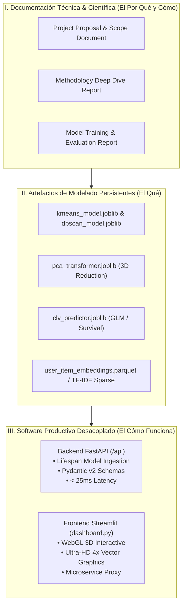

# 📐 Estándar de Rigor Metodológico para Proyectos de Data Science & MLOps

**Documento Marco:** Protocolo de Excelencia Científica, Ingeniería de Software y Auditoría de Producción  
**Autor:** Guillen Concepción — *Senior Data Scientist & MLOps Engineer*  
**Perfil Profesional:** [LinkedIn](https://www.linkedin.com/in/guillen-concepcion-25266b127) | [GitHub](https://github.com/GuillenConcepcion) | [Email](mailto:guillenconcepcion@gmail.com)  
**Ámbito de Aplicación:** Todos los proyectos de Inteligencia Artificial, Machine Learning y Data Science del ecosistema.

---

## 🎯 Declaración de Principios y Propósito

En entornos corporativos y de consultoría avanzada, un proyecto de Data Science **nunca es un script aislado o un notebook desordenado**. Para superar una revisión de arquitectura (*Architecture Review*) o un *Code Review* de nivel Senior / Staff, la solución debe articularse en tres dimensiones interconectadas:

1. **El "Por Qué" y "Cómo" (Rigor Teórico & Documentación):** Justificación matemática, econométrica y estadística de cada decisión algorítmica.
2. **El "Qué" (Artefactos Serializados):** Modelos, transformadores y embeddings persistentes, reproducibles y versionados.
3. **El "Cómo Funciona" (Software Productivo):** Servicios desacoplados (API REST + Dashboard) con contratos tipados, baja latencia y pruebas automatizadas.



---

## 📑 I. Documentación Técnica y Científica (El "Por Qué" y "Cómo")

Todo repositorio debe contener tres informes formales estructurados para auditorías técnicas y comités ejecutivos:

### 1. Project Proposal & Scope Document (Definición de Alcance & Negocio)
* **Resumen Ejecutivo:** Declaración explícita del problema de negocio, justificación de la inversión y objetivos cuantitativos.
* **KPIs de Negocio a Medir:**
  * Incremento proyectado en el *Click-Through Rate* (CTR) y tasa de conversión ($\Delta \text{CR} \ge +15\%$).
  * Maximización del Customer Lifetime Value ($\Delta \text{CLV}$) y mitigación de la tasa de fuga (*Churn Hazard*).
  * Retorno de Inversión publicitaria (ROAS) y eficiencia de capital en campañas de retención mediante optimización con restricciones de presupuesto.
* **Diagrama de Arquitectura Técnica:** Diagrama de flujo detallado en Mermaid o UML que describa la topología completa:
  $$\text{Data Ingestion} \longrightarrow \text{Quality Gates} \longrightarrow \text{FastAPI Service} \longrightarrow \text{Model Registry} \longleftrightarrow \text{Streamlit UI}$$

### 2. Methodology Deep Dive Report (Justificación Algorítmica & Trade-offs)
* **Detalle Comparativo de Modelado:**
  * **K-Means vs. DBSCAN:** Justificar formalmente por qué se utiliza K-Means como particionador global $(\mathcal{O}(knt))$ y DBSCAN como auditor de densidad no paramétrica $(\mathcal{O}(n \log n))$ para aislar anomalías y ruido ($\text{label} = -1$).
  * **Coeficiente de Fusión Convexa ($\alpha$):** Demostración analítica de la ponderación entre el camino colaborativo (SVD) y el camino semántico (TF-IDF NLP):
    $$\text{Score}_{\text{Híbrido}}(u, i) = \alpha \cdot \hat{S}_{\text{SVD}}(u, i) + (1 - \alpha) \cdot \hat{S}_{\text{Content}}(u, i)$$
* **Análisis Crítico de Trade-offs y Limitaciones:**
  * **Problema de Arranque en Frío (*Cold-Start*):** Estrategias formales de fallback para usuarios con historial insuficiente ($<3$ reviews $\to$ Popularidad Bayesiana) y nuevos ítems del catálogo ($\alpha = 0 \to$ Similaridad Coseno pura).
  * **Maldición de la Dimensionalidad vs. Pérdida de Información:** Análisis espectral de varianza explicada acumulada en PCA 3D vs. estabilidad geométrica de distancias euclídeas.

### 3. Model Training & Evaluation Report (Validación Cuantitativa)
* **Métricas Cuantitativas y Validación Cruzada:**
  * **Predicción de CLV / Regresión:** Reportar rigurosamente el Coeficiente de Determinación ($R^2$), el Error Cuadrático Medio ($RMSE$), la Devianza de Poisson y el Error Absoluto Medio ($MAE$) bajo $k$-fold cross-validation estratificado.
  * **Clustering y Topología:** Reportar el Coeficiente de Silueta ($s \in [-1, 1]$), el Análisis del Codo (*Elbow Method* vía inercia) y la pureza de partición frente al índice Davies-Bouldin.
* **Benchmark Comparativo:** Tabla obligatoria enfrentando la solución contra baselines de la industria:
  * Modelo puramente colaborativo vs. Modelo basado únicamente en contenido vs. Arquitectura Híbrida Dual.
  * Regresión lineal estándar (OLS) vs. GLM Poisson con cadencia *Buy-Till-You-Die* (BTYD).

---

## 💾 II. Artefactos de Modelado Persistentes (El "Qué")

En producción, **el entrenamiento nunca ocurre en tiempo de inferencia**. Todos los modelos matemáticos y matrices de proyección deben ser artefactos serializados, versionados y almacenados en la carpeta `models/`:

| Nombre del Artefacto | Tipo de Objeto | Librería / Formato | Responsabilidad en Producción |
|---|---|---|---|
| `cluster_model.joblib` / `kmeans_model.pkl` | `CustomerClusterModel` | Scikit-Learn + Joblib | Asigna cualquier cliente a uno de los $K$ arquetipos comerciales y calcula la distancia a su centroide. |
| `dbscan_model.joblib` | `DBSCAN` | Scikit-Learn | Parámetros aprendidos ($\epsilon, \text{MinPts}$) para auditoría de densidad y etiquetado de ruido. |
| `pca_transformer.joblib` | `PCA(n_components=3)` | Scikit-Learn | Matriz ortogonal de autovectores para proyectar tensores RFM al hiperespacio 3D en tiempo constante $\mathcal{O}(d \cdot k)$. |
| `clv_model.joblib` / `clv_predictor.pkl` | `CustomerLifetimeValueModel` | Scikit-Learn (GLM Poisson) | Acepta la tupla transformada $(R, F, M, T)$ y predice el gasto futuro descontado por NPV. |
| `recommender.joblib` | `HybridRecommender` | SciPy Sparse + Joblib | Almacena matrices factorizadas $U, \Sigma, V^T$ (TruncatedSVD), vocabulario TF-IDF y centroides de gusto. |
| `customer_profiles.parquet` | Apache Parquet Tabular | PyArrow / Fastparquet | Base de datos analítica pre-indexada de perfiles de clientes para inferencia P99 $< 25\text{ ms}$. |

> [!IMPORTANT]
> **Regla de Oro de Serialización:** Todo pipeline debe incluir un script de validación que cargue los artefactos `.joblib` en un entorno limpio y ejecute una inferencia de prueba unitaria antes de autorizar el despliegue a producción.

---

## 💻 III. Componentes de Software Ejecutables (El "Cómo Funciona")

Para garantizar estándares de ingeniería de software empresarial, el backend y el frontend deben operar como **microservicios desacoplados**:

### 1. Backend REST API (`FastAPI`)
* **Ubicación:** Directorio `src/<proyecto>/api/` con punto de entrada en `main.py`.
* **Esquemas Fuertes (Pydantic v2):** Validación estricta de contratos en tiempo de compilación y ejecución:
  * `POST /api/predict_clv`: Ingesta el identificador de cliente o tupla conductual y devuelve $CLV_{\text{pred}}$, coordenadas 3D $(x, y, z)$, distancia al centroide y estrategia de retención.
  * `POST /api/recommendations`: Devuelve Top-$N$ SKUs con desglose de puntaje híbrido, procedencia algorítmica y paginación.
* **Patrón Lifespan (`@asynccontextmanager`):**
  * Los modelos serializados se cargan en la memoria RAM del servidor **una única vez durante el arranque (*startup*)** y se comparten entre peticiones asíncronas concurrentes, erradicando el sobrecoste de I/O en disco.
  * **Latencia Máxima Admitida:** Inferencia P99 $< 25\text{ ms}$.

### 2. Frontend Analytics Dashboard (`Streamlit`)
* **Ubicación:** Archivo principal `app/streamlit_app.py` o `dashboard.py`.
* **Arquitectura de Microservicio:** El frontend no contiene lógica de entrenamiento ni instancia modelos pesados; **consume exclusivamente los endpoints de FastAPI** mediante peticiones HTTP estructuradas (`requests` / `httpx`).
* **Visualización de Nivel Publicación:**
  * **Gráficos 3D Interactivos (Plotly WebGL):** Dispersión tridimensional con trazado de vector discontinuo (*dashed line*) desde las coordenadas del usuario hasta el centroide de su cluster.
  * **Exportación Ultra-HD:** Configuración de descarga en vector SVG escalable a 4x:
    ```python
    toImageButtonOptions: {'format': 'svg', 'scale': 4}
    ```
  * **Paneles Estadísticos a 300 DPI:** Integración de Seaborn y Matplotlib con `plt.rcParams['figure.dpi'] = 300` para informes de calidad académica.

### 3. Orquestación y Reproducibilidad (`Docker Compose`)
* `Dockerfile` multi-stage para optimizar peso de imagen y superficie de seguridad.
* `docker-compose.yml` que levanta la red interna comunicando el backend (`:8000`) y el frontend (`:8501`) con políticas de reinicio automático (`restart: unless-stopped`).

---

## ✅ Resumen Visual del Ecosistema de Entrega

Cualquier proyecto de Data Science ejecutado bajo este estándar se presenta a directores y evaluadores como una **Caja de Herramientas Industrial (Enterprise AI Toolkit)**:

| Nivel | Artefacto de Entrega | Formato / Ubicación | Propósito Estratégico de Negocio |
|---|---|---|---|
| **💡 Insight** | Reporte Estadístico & Inferencial | `docs/*.md` / Notebooks | Responde a: *"¿Quién es el cliente más valioso, cómo se distribuye la riqueza (Gini) y por qué ocurren los patrones de compra?"* |
| **⚙️ Motor (Backend)** | Microservicio API Asíncrono | `src/**/api/main.py` (FastAPI) | Sirve scoring predictivo y recomendaciones en tiempo real ($< 25\text{ ms}$) con alta concurrencia. |
| **🖥️ Visualización** | Cockpit Ejecutivo Interactivo | `app/streamlit_app.py` (Streamlit) | Permite a directores y gerentes sin conocimiento de código simular carritos, optimizar presupuestos y explorar clusters 3D. |
| **📦 Fundamentos** | Model Registry Persistente | `models/*.joblib` & `*.parquet` | Garantiza reproducibilidad matemática, versionado auditable y arranque instantáneo sin reentrenamiento. |
| **🧪 Calidad (QA)** | Suite de Pruebas Automatizadas | `tests/test_*.py` (Pytest) | Asegura que el 100% de los contratos de datos, transformaciones numéricas y endpoints funcionen sin regresiones. |

---

---

## 📋 Protocolo de Auditoría Pre-Publicación (Nivel Senior / Staff)

Todo repositorio de Machine Learning y Data Science debe superar y documentar formalmente la **Auditoría Pre-Publicación** en `AUDITORIA_PRE_PUBLICACION.md` antes de cualquier entrega productiva o difusión en GitHub y LinkedIn:

### I. Estructura del Repositorio y Organización General
- [ ] **README.md Impecable:** Descripción concisa del problema de negocio, diagrama de arquitectura en Mermaid, instalación paso a paso (`pip install -r requirements.txt`), comandos de ejecución y sección de resultados con KPIs finales.
- [ ] **Estructura Modular (SRP):** Segregación estricta de responsabilidades (`data/`, `features/`, `models/`, `api/`, `app/`). Prohibidos los scripts monolíticos.
- [ ] **Requirements Pinned:** Versiones exactas fijadas de todas las dependencias (`scikit-learn==X.Y.Z`, `fastapi==X.Y.Z`) para garantizar 100% de reproducibilidad.

### II. Calidad del Código y Prácticas (Clean Code)
- [ ] **Single Responsibility Principle (SRP):** Clases y módulos con una única responsabilidad desacoplada.
- [ ] **Docstrings Completos (Google / NumPy Style):** Obligatorio en todas las funciones y clases públicas, documentando `Args:`, `Returns:` y `Raises:`.
- [ ] **Manejo Específico de Excepciones:** Captura de excepciones específicas (`KeyError`, `ValueError`, `IOError`). Cero bloques bare `except:` o `except Exception:` genéricos en la lógica de negocio.

### III. Aspectos Técnicos del Modelo (Reproducibilidad & Robustez)
- [ ] **Versionado de Modelos:** Artefactos entrenados serializados explícitamente (`.joblib`, `.parquet`, `.json`) en un registro `models/`.
- [ ] **Trazabilidad de Hiperparámetros:** Documentación explícita de valores probados (GridSearchCV o manual tuning), curvas de evaluación y justificación de selección.
- [ ] **Manejo Riguroso del Cold-Start ($0.0\%$ fallos):** Lógica explícita de fallback para usuarios nuevos (popularidad bayesiana) y productos nuevos (similitud semántica de contenido).

### IV. Arquitectura de Despliegue (FastAPI & Streamlit)
- [ ] **Separación Estricta de Capas:** Microservicio REST desacoplado del frontend. El dashboard es exclusivamente un consumidor de servicios o pipelines empaquetados.
- [ ] **Manejo de Latencia y Caching:** Implementación de `@st.cache_resource` y `@st.cache_data` en Streamlit, y precarga asíncrona mediante Lifespan en FastAPI (latencia P99 $< 25\text{ ms}$).
- [ ] **Concurrencia Asíncrona sin Bloqueos:** Endpoints FastAPI concurrentes con gestión adecuada de hilos y contratos fuertemente tipados en Pydantic v2.
- [ ] **Test Suite 100% Verde:** Suite automatizada en `pytest` cubriendo datos, transformaciones, modelos y endpoints pasando al 100%.
- [ ] **Demo Rápida en 10 Segundos:** Script CLI autocontenido `scripts/demo_quickstart.py` funcional y reportado en la documentación.

---

*Estándar de calidad técnica, rigor metodológico y arquitectura MLOps formulado por Guillen Concepción.*
